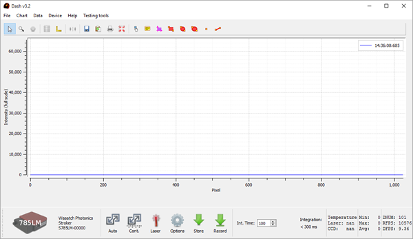
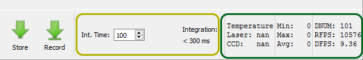
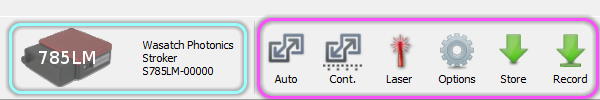

**We are currently developing a new version of the Dash manual.**

# Dash Manual
1. Introduction and Installation
2. Software Interface.
3. Working with stored data.
4. External Input/Output control.
5. Troubleshooting.

## 1. Introduction

The Dash spectrrometer software is designed to provide 

### System Requirements
- **Operating Systems:** Windows 10, 8, and 7
- **Processor:** Intel i7 Suggested
- **RAM:** 4GB Required

## Installation
**Dash installation has been verified on Windows 7x32, 7x64, 10x64.**

1. Ensure that the spectrometer is **not** connected to the system.
2. Run the provided Dash-setup.exe file.
    - Accept all of the defaults during installation
    - If prompted that the publisher of the driver could not be verified, **Select Install this driver software anyway**.
    

3. Click **Finish** to launch the Dash application.
4. Connect your instrument to your computer using the appropriate USB cable. 
    - Windows will notify you that it is installing the driver software. This process may take a minute or two. Wait for it to finish and you will see the instrument connect in the software.
    
## 2. Software Interface
The instrument should be connected to the computer through the USB and powered using the supplied power adapter. The software is launched using the Dash shortcut in the Programs or All Apps menus. At first startup, the user should expect to see an interface like the following.

- **Red:** The main menu bar
- **Blue:** Chart Options
- **Center:** The center graph area is your reported spectra
- **Yellow:** Integration time setting and reporting.
- **Green:** Data summary and performance metrics
- **Teal:** Device Information
- **Purple:** Primary control buttons

**The Main Menu Bar** and **Chart Options Toolbar** are used to load and save data, as well as access chart viewing functions (such as auto-scaling).

**Integration Time Setting and Reporting** section allows you to specify (in ms) the length of the integration time of the image. Once this is set a counter will display how long until your next sample if your integration time is longer than 300ms.

**Data Summary** area will display temperature readbacks, minimum and maximum reported values, as well as performance metrics. 

**Device Information** area reports the instrument that is connected, along with it's serial number.

**Primary Control Buttons** include the Laser power control, Options Interface Toggle, and spectra storage buttons.

### Options Panel Description
There are seven tabs available under the Options Toggle button found in the purple highlighted section.

#### CCD Options Tab

- **IntegrationTime:** Time in milliseconds to integrate during capture.
- **Offset:** Larger values move the spectrum upwards. Valid numbers can range from 0 to 65,533.
- **Gain:** Digital gain value is a floating point. ranging from 0.0 to 10.0.
- **CCD Setpoint:** When CCD cooling is available, this will specific the target temperature in degrees Celsisus
- **CCD Cooling:** When CCD cooling is avilable, this will enable or disable this feature.
- **CCD Test Pattern:** Returns a ramping value to verify data connectivity.
- **TEC Coefficients:** When CCD cooling is available, this configures the temperature setpoint conversion coefficients.
- **External Trigger:** Specifies if an external trigger is to be used. This feature is only available on units with an IO option.
- **DAC Value:** On instruments with an IO option, this will specific a voltage output from the spectrometer.

#### CMOS Options Tab

- **Offset:** Larger values will move the spectrum up, smaller numbers will move the spectrum down. Valid inputs range from 0 to 255.
- **Gain:** Adjusts the gain of the CMOS sensor. Valid inputs range from 0 to 255.
- **Line Time:** Time in microsconds for a single data capture.
- **Integration  Time:** Time in microseconds to integrate during a capture. This must be less than the line time.
- **Trigger:** Enables and disables the external trigger. This option is only valid with instruments equipped with an IO option.
- **Test Pattern:** Returns a ramp of values across the range of pixels.

#### Light Source Options Tab

- **Source Wavelength:** Specifies the source wavelength in nanometers for correct calibration in the Wavenumber view.

#### Calibration Options Tab

- Calibration coefficients should match those provided by Wasatch Photonics. If you change these values by accident. Search for your device on http://www.waspho.com/ using your instrument's serial number. This will list the coefficients used when your device was shipped.

#### Acquisition Options Tab

- **Record:** Specifies the number of acquisitions to store when the Record button is clicked or tapped.

#### Logging Options Tab

- Show detailed information on the Dash spectrometer control software underlying processes not usually shown to the user.

#### InGaAs Options Tab

- InGaAs sensor specific features.

### Recorded Data Area
- Shows detailed information on recorded data.

 

## 3. Working with stored data

### Overlaying spectra
After storing data using either the Store or Record tool, the stored data list will appear in the main interface. Select individual records by clicking on them, or use the shift and control buttons on your keyboard to select groups of records. After selection, click the **Update Graph** green button to show the selected entries in the main graph area. Double click the note field to type in notes specific for a data entry.

### Subtracting blanks
The **Make Blank** button us used to assign a particular spectra from the history as a "Blank Spectra". This means that any spectra viewed after assigning a blank has the blank specta subtracted from it. To "unassign" a blank, choose the blank frame and hit the "make unblank" button. Note that if the spectra history is saved to file, only the raw data is saved, not the subtracted spectra. However, one can manually subtract spectra since all of the history, including annotations of which frame is blank spectra frame, is saved to file.

### Deleting spectra
Use the Clear button to remove all spectra from the recorded data area and the delete selected spectra button to remove individual entries.

### Averaging spectra
Consider the following narrative to create an average of 10 spectra: Go to the Options > Acquisition tab, and set the record spectra control entry to 10. Position the sample as required, then click the Record button. Shift-click the first and last entries in the recorded spectra area, then click the Average button. The user will then see a new entry added in the recorded spectra area that comprises an average of the selected spectra, with an appropriate designation in the note field.

## 4. External input/output control
On certain systems equipped with the External I/O board, the connection is shown in detail below:

 

## 5. Troubleshooting
Please contact our systems division with any troubleshooting questions.

info@wasatchphotonics.com 
